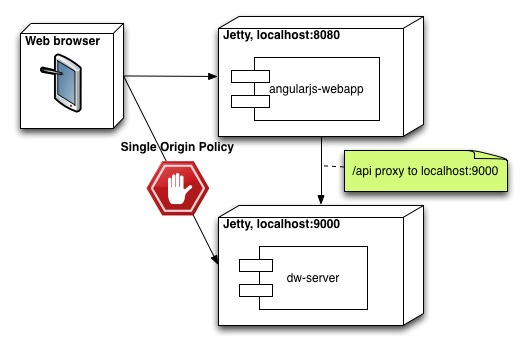

# General info

This is a little example application that I have used to learn to use the AngularJS and Dropwizard
frameworks. It also serves as a project template that can be used to get a new project up and running
quickly. The goals of the project

# Architecture information

AngularJS is used to create a simple webapp (angular-webapp module), while Dropwizard has
been used to create a backend server with RESTful services (dw-server). The two are deployed in different
web servers, as shown here:

# Topics that have been explored

## AngularJS
- organizing an AngularJS webapp in modules and partials
- AngularJS directives, filters, calling backend services via $resource, etc.
- using Bootstrap with AngularJS

## Jetty
- using Jetty for both the webapp and the backend services
- embedding Jetty in the application in dw-server so that it is very easy to run and debug from the IDE.
- configuring Jetty in the angular-webapp as a proxy to the dw-server in order to tackle the issue that
  a JavaScript application is not allowed to call back to another server than it's origination server.

## Dropwizard
- creating RESTful (JSON) services with Jersey & Jackson, including health checks
- creating persistence logic with JDBI

## Maven
- using the the [appassembler-maven-plugin](http://mojo.codehaus.org/appassembler/appassembler-maven-plugin/index.html)
to generate a script that will set the classpath and run the webapp
- building fat JARS with [Maven Shade Plugin](http://maven.apache.org/plugins/maven-shade-plugin/) making it
possible to deploy Dropwizard services as single .jar files.

